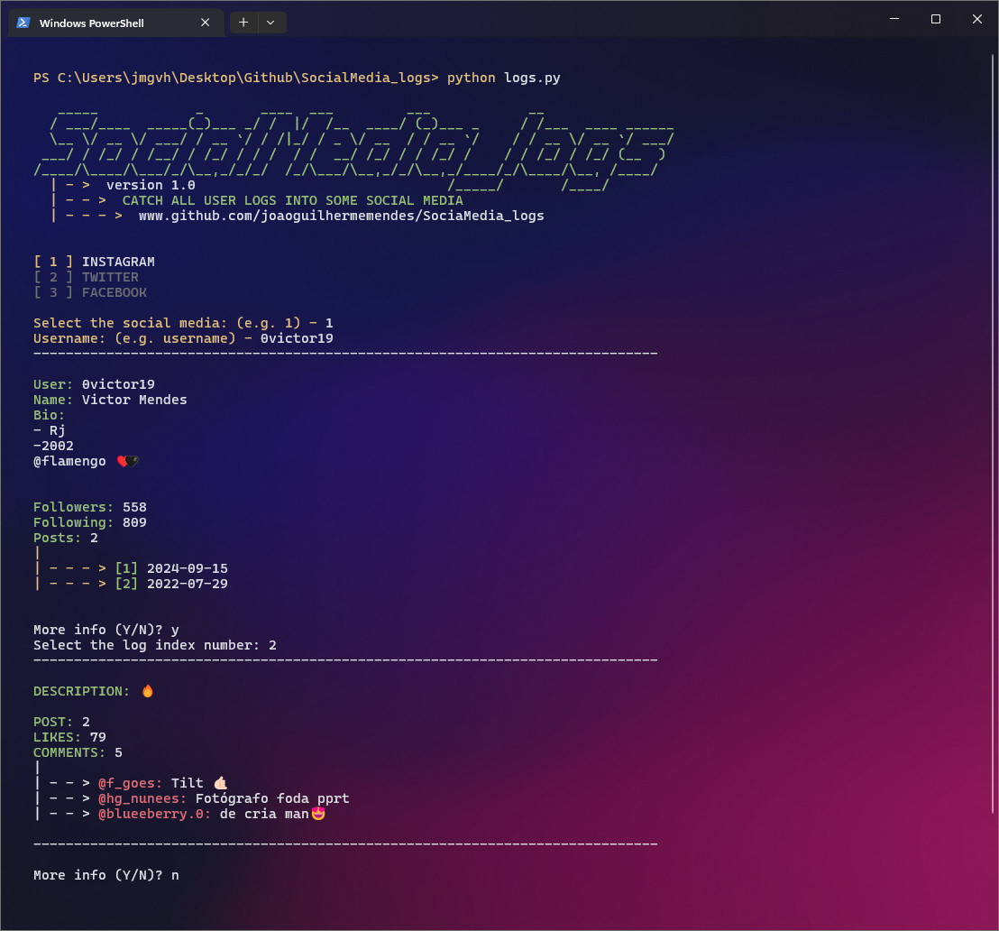

# SocialMedia Logs

This project is designed to manage and analyze instagram logs. It provides tools to collect, process, and visualize data from instagram.


## Installation

1. Clone the repository:
    ```sh
    git clone https://github.com/yourusername/SocialMedia_logs.git
    ```
2. Navigate to the project directory:
    ```sh
    cd SocialMedia_logs
    ```
3. Install the required dependencies:
    ```sh
    pip install -r requirements.txt
    ```

## Usage

1. Collect data:
    ```sh
    python logs.py
    ```

## Demo



## Current Version and Future Features

The current version of the project supports data collection, processing, and visualization exclusively for Instagram. 

In future updates, we plan to expand support to include additional social media platforms. However, this expansion is not expected to happen in the immediate future.

## Features
- [ ] **Data Collection**: Gather logs from multiple social media platforms.
- [ ] **Data Processing**: Clean and preprocess the collected data.
- [ ] **Data Visualization**: Generate insightful visualizations from the processed data.


## Contributing

Contributions are welcome! Please open an issue or submit a pull request for any changes.

## License

This project is licensed under the MIT License. See the [LICENSE](LICENSE) file for details.

